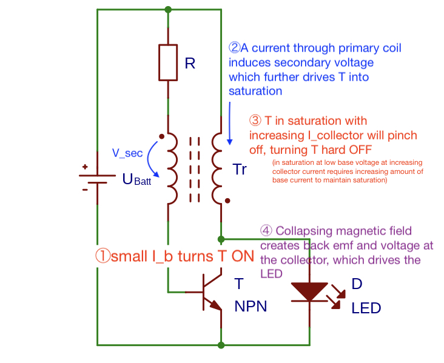

Today I cleared up some personal misconceptions about how the [Joule Thief](Joule%20Thief) works. 

Previously I had the induced voltage of the "secondary" winding wrong, as I thought it helped to turn off the transistor while the current was increasing in the primary winding.

_Corrected annotations, not sure why I used T instead of Q 🤷‍♂ _

Now I added the correct voltage polarity to the induced secondary voltage during ②, increasing current through the primary coil. The voltage is induced such that it **adds** to the battery voltage, _further turning on the transistor_. 

This is how the transistor "slams" on with this positive feedback. I'm still understanding the turn off condition, whether it is from the core saturating or from the transistor saturating and then "pinching off" (the wikipedia article mentions both). 

Either way, the voltage polarity during the turn off now makes sense as well. During turn off the decreasing current in the primary results in a voltage that decreases the base voltage, thus "slamming" the transistor off.
