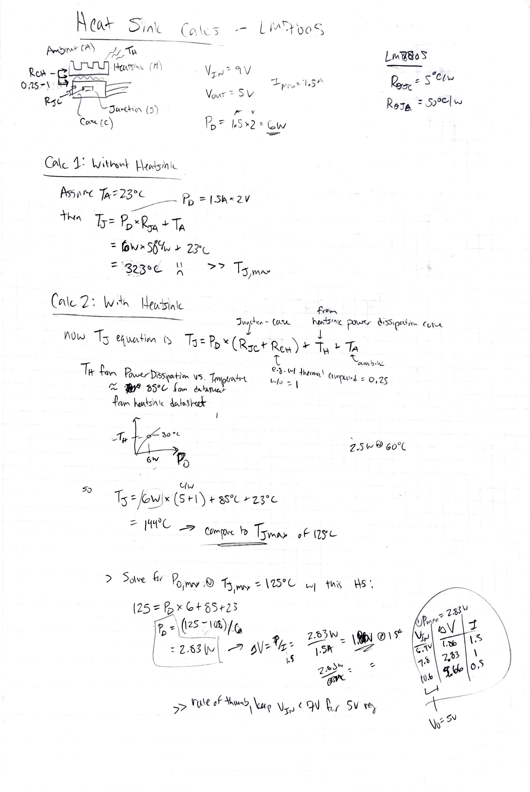

TODO - copy from [Example - Heatsink Sizing Thermal Calculations](Example%20-%20Heatsink%20Sizing%20Thermal%20Calculations)

My friend Emery. told me that really for a 5V linear regulator you shouldn't exceed really more than 7V, since it just throws away all the excess as heat. 

Since the power dissipation is just $P_D = \Delta V \times I_{OUT}$, and the maximum $T_J$ for e.g. a [LM7805](LM7805) is around 125C, and the $R_{JA}$ rise is like 50C/W. We can see that we can only dissipate less than 3W without a heat sink.

So if you want to push the 5V linear regulator to drive a raspberry pi, which can consume up to 1.5A, you can only get away with a voltage difference of 2V, so only a 7V input. 

So without going through the math, Emery was right. 

Here are the calcs, per the guide at https://learn.sparkfun.com/tutorials/understanding-thermal-resistance/all:

